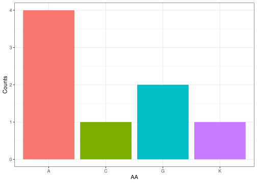

<!-- README.md is generated from README.Rmd. Please edit that file -->

# Bioporongs

<!-- badges: start -->
<!-- badges: end -->

The goal of Bioporongs is to …

## Installation

You can install the development version of Bioporongs from
[GitHub](https://github.com/) with:

``` r
# install.packages("devtools")
devtools::install_github("rforbiodatascience24/group_05_package")
```

``` r
library(Bioporongs)
```

# Description of the Packages

This R package provides tools to simulate and analyze nucleic acid
sequences, allowing users to create a random DNA sequence, convert it to
RNA, segment it into codons, and finally translate these codons into an
amino acid sequence. By starting with the random DNA generator, users
can quickly obtain a sequence that can be converted to RNA, making it
compatible for further processing. The RNA sequence can then be divided
into codons, with customizable start points, to reflect different
reading frames. Finally, the codon sequence is translated into its
corresponding amino acid sequence, facilitating analysis of
protein-coding regions and supporting applications in genetic studies,
bioinformatics, and sequence analysis tasks.

### Function 1 - Random_DNA_seq

This function creates a random DNA sequence with a specific *sequence
length*.

``` r
#EXAMPLE
Random_DNA_seq(10)
#> [1] "ATCGCTAATG"
```

This is the sequence that can then be used in the following function.

### Function 2 - dna2rna

This function takes a given *dna_seq* and returns its corresponding RNA
sequence

``` r
#EXAMPLE
dna2rna("ATGCGTACGTTAGCCGTAGCTTGAATGCTAGC")
#> [1] "AUGCGUACGUUAGCCGUAGCUUGAAUGCUAGC"
```

### Function 3 - get_codons

This function divide a biological nucleic-acid sequences (DNA or RNA)
and returns a list of the codons. The starting point can be modified
with the argument *start*.

``` r
#EXAMPLE
get_codons("ATGCGTACGTTAGCCGTAGCTTGAATGCTAGC", start = 3)
#>  [1] "GCG" "TAC" "GTT" "AGC" "CGT" "AGC" "TTG" "AAT" "GCT" "AGC"
```

## Function 4 - aminoacid_sequence

This function gets the sequence of *codons* and returns the amino acid
sequence translation

``` r
#EXAMPLE
aminoacid_sequence(c("AUG", "UUU", "UUA", "UGG", "UCU"))
#> [1] "MFLWS"
```

### Function 5 - BarplotAAFreq

This function receives a sequence of Amino acids and returns a barplot
with the frequency of each of the Amino acids in the chain

``` r
#EXAMPLE
BarplotAAFreq("AAAGGCAK")
```


